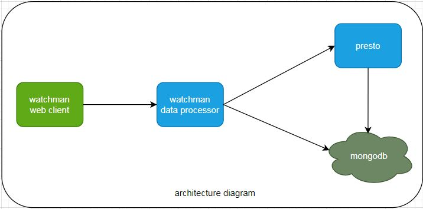

    

    <b>watchmen is a lighter engine for data analytics.</b>

    See the <a href="https://www.watchmen.com/docs/current/">User Manual</a> for deployment instructions and end user documentation.

## Build requirements

* Mac OS X or Linux or Windows
* Python 3.7+, 64-bit
* Docker

## Building watchmen-data-processor

##Quick Start

### Overview

