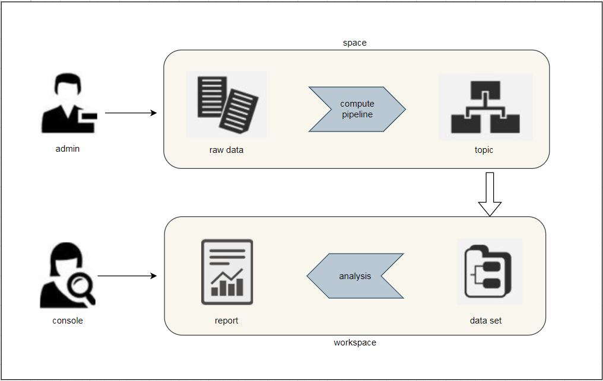

<p align="center">
    <a href="https://www.watchmen.com/"></a>
</p>
<p align="center">
    <b>watchmen is a lighter platform for data analytics.</b>
</p>
<p align="center">
    See the <a href="https://www.watchmen.com/docs/current/">User Manual</a> for deployment instructions and end user documentation.
</p>

[](https://github.com/Indexical-Metrics-Measure-Advisory/watchmen-matryoshka-doll/blob/master/LICENSE)
)
[](https://github.com/Indexical-Metrics-Measure-Advisory/watchmen-matryoshka-doll/actions/workflows/publish-image.yml)

# Overview

<p align="center">

</p>

watchmen-matryoshka-doll is the back-end server for the watchmen data platform. 

# Use Case

<p align="center">

</p>


# Build Requirements

* Mac OS X or Linux or Windows
* Python 3.7+, 64-bit
* Docker

# Start
local start

```
python app.py  
##or   
uvicorn watchmen.main:app
```

# Docker Run

```
docker run --name watchmen-matryoshka-doll -v /usr/watchmen/watchmen-matryoshka-doll/temp/rotating.log:/app/temp/rotating.log --env-file /usr/watchmen/watchmen-matryoshka-doll/env.list -p 8000:80 -d  ghcr.io/indexical-metrics-measure-advisory/watchmen-matryoshka-doll:latest
```

# Configuration

```
PROJECT_NAME=matryoshka
MONGO_HOST=localhost
MONGO_PORT=27017
MONGO_MONITOR_HOST=localhost
MONGO_MONITOR_PORT=27017
PRESTO_HTTP_URL=http://localhost:8080
PRESTO_HOST=localhost
PRESTO_PORT=8080
WORKERS_NUM=2
```

# Presto Configuration

```
connector.name=mongodb
mongodb.seeds=localhost:27017
```

# License & Distribution

Under MIT License.

When you use our product, for internal use or build copies for your clients,  include a license file contains the following statement and copy it into your presentation materials.

> Powered by Matryoshka Data.
