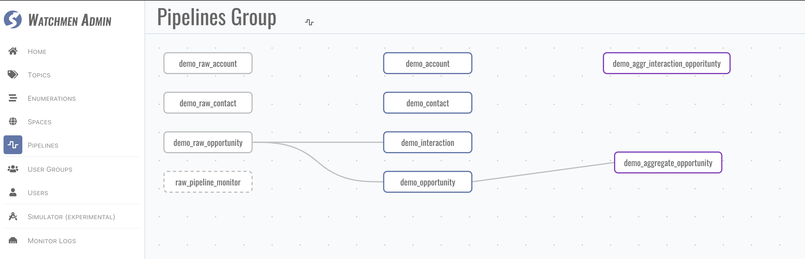

<p align="center">
    <a href="https://www.watchmen.com/"></a>
</p>
<p align="center">
    <b>watchmen is a lighter platform for data analytics.</b>
</p>
<p align="center">
    See the <a href="https://imma-watchmen.com">User Manual</a> for deployment instructions and end user documentation.
</p>

[](https://github.com/Indexical-Metrics-Measure-Advisory/watchmen-matryoshka-doll/blob/master/LICENSE)
)
[](https://github.com/Indexical-Metrics-Measure-Advisory/watchmen-matryoshka-doll/actions/workflows/publish-image.yml)

# Getting Started with Watchmen Platform

<p className="text-2xl mt-0 text-gray-500 tracking-tight font-light">
  Watchmen Platform is a low code data platform for data pipeline,mate data managment , analysis and qulity managment 
</p>

<div className="md:col-span-3 flex flex-wrap md:flex-nowrap items-center bg-gradient-to-b from-blue-400 to-blue-500 shadow-lg rounded-2xl py-6 md:py-2 px-6 md:pr-5 space-y-4 md:space-y-0 md:space-x-8">
  <p className="flex-auto text-white text-lg">
    New to Watchmen Platform? Learn all about the library in a short tutorial.
  </p>
  <a
    href="https://imma-watchmen.com/#/tutorial"
    className="flex-none bg-blue-600 hover:bg-blue-700 transition-colors duration-200 text-white font-semibold rounded-lg py-3 px-4 no-underline"
  >
    Take the Tutorial
  </a>
</div>

Or read about:

- Watchmen [Main Concepts](https://imma-watchmen.com/#/main_concepts)
- [How to deploy Watchmen](https://imma-watchmen.com/#/deployment)
- [How to integrate Watchmen with other BI tools](https://imma-watchmen.com/#/integration)
- [Extensibility](https://imma-watchmen.com/#/extensibility)
- [Best practices guides](https://imma-watchmen.com/#/best-practice)
- Watchmen full [API Reference](https://imma-watchmen.com/#/api)
- Watchmen's open source [Community](https://imma-watchmen.com/#/community)  

## Quick Starts

### Installing Watchmen Platform with docker compose file 

To install Watchmen Platfrom 

git clone repositorie  https://github.com/Indexical-Metrics-Measure-Advisory/watchmen-quick-start

```bash
cd docker 
docker compose -f docker-compose-mongo.yml  up

```


### Import sample data and view pipeline  


```bash
cd ..   # back to root folder 
docker run   --mount type=bind,source="$(pwd)"/test_case,target=/app/test_folder  --network host  -e SITE=local -e INIT=True  ghcr.io/indexical-metrics-measure-advisory/watchmen-doll-test-doll:latest

```
The log will show the successful import of initialization data and instance data。


Then navigate to <http://localhost:3030> and use  demo_user/abc1234 to login the system.

navigate to pipeline page and start your first pipeline. 



## If You Get Stuck

If you have questions on getting started, we'd love to hear from you:

send email to tech-support@matrdata.com

# License & Distribution

Under MIT License.

When you use our product, for internal use or build copies for your clients,  include a license file contains the following statement and copy it into your presentation materials.
